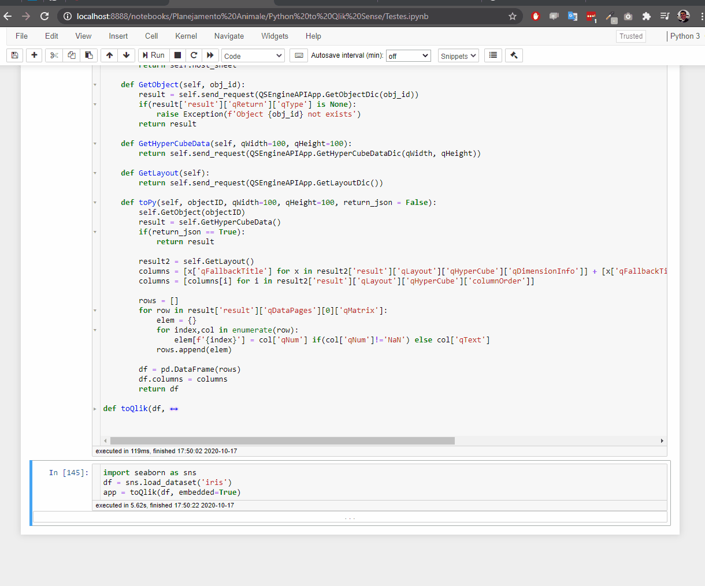

# PyToQlik

PyToQlik is a library that allows you to integrate Qlik Desktop with Jupyter notebooks. With it you can:

* Open and edit a Qlik app inside a Jupyter notebook;
* Create a Qlik object with data from a pandas DataFrame data structure and/or;
* Import data from a Qlik object and create a pandas DataFrame to work with in Python.

## Getting Started

For this library to work you must have a functioning Qlik Desktop App installed and running on your local machine. You will also need to have the *pandas* library and a Jupyter Notebook local server (read https://jupyter.readthedocs.io/en/latest/running.html).


You can then download and install PyToQlik using:

**Installation**
```
pip install pytoqlik 
```

## Usage

### Example 1

**Creating a Qlik app and feeding it data**
```
from pytoqlik import Pytoqlik
import seaborn

df = seaborn.load_dataset('tips')  # df is just some example data provided by the seaborn library

p2q = Pytoqlik()
app = p2q.toQlik(df)
```

### Example 2

**Importing data from a Qlik object to Python**
```
from pytoqlik import Pytoqlik
import seaborn

df = seaborn.load_dataset('tips')  # df is just some example data provided by the seaborn library

p2q = Pytoqlik()
app = p2q.toQlik(df)
app.toPy('your ObjectID')
```

## Step by step guide


---

### Documentation

PyToQlik current documentation can be found [HERE](https://github.com/BeautyFades/pytoqlik/blob/main/PyToQlik%20Documentation.md).

---

### Features in development

#### Connectivity
- Qlik Enterprise support
- Qlik Cloud robustness

#### Functionality
- Data fetching based on dimensions and measures
- More robust embedding objects and sheets
- More robust script editing
- Object creation and manipulation via Python
- Auxiliary functions, app listing and object listing
- Task creation and managing
- ETL features in Python
